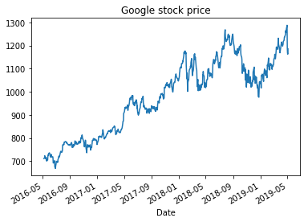
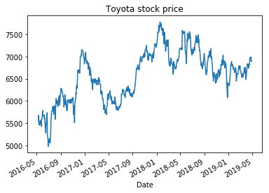

# google-fincance-webscraper
Pythonでgoogle financeから株価データを取得するwebscraper。

2018年8月から従来のgoogle finance apiが利用できなくなったため、その代替案として本コードを使用できます。

特徴
- 日本株にも対応しています。
- 日足だけでなく、分足も取得できます。
- ダウンロードできるのは、時刻と終値だけです。出来高や始値などは取得できません。

機械学習や時系列データ分析の勉強などが目的であれば、終値データだけでも役に立つでしょう。

## 使い方
### 株価データの取得

    from google_finance_downloader import get_google_finance_market_id, GoogleFinanceHistorical

    # Googleのmarket_idを取得する
    market_id_google = get_google_finance_market_id("NASDAQ: GOOG")
    downloader = GoogleFinanceHistorical()

    # Googleの株価データを取得する。過去3年間の日足の終値をpandas.Dataframeのデータで得る。
    downloader.get_google_finance_historical(market_id_google, period="3Y", interval=60 * 60 * 24)
    df_google_daily = downloader.data

    # トヨタ自動車の株価データを取得する(銘柄コード7203)
    market_id_toyota = get_google_finance_market_id("TYO: 7203")
    # 過去3年間の日足の終値
    downloader.get_google_finance_historical(market_id_toyota, period="3Y", interval=60 * 60 * 24)
    df_toyota_daily = downloader.data
    
### 株価をチャートで表示

    df_google_daily.set_index("Date").Close.plot(title="Google stock price")

    df_toyota_daily.set_index("Date").Close.plot(title="Toyota stock price")

## License
本コードの利用にはMIT Licenseが適用されます。
